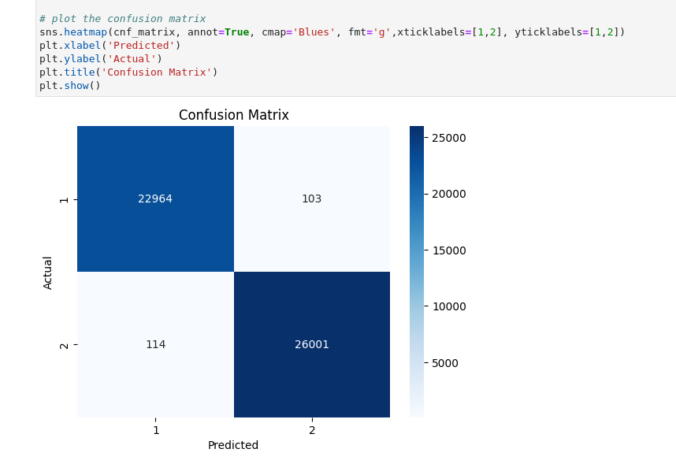

# Random Forest Feature Selection and Binary Classification on Trading Data

Welcome to this GitHub repository, featuring a Machine Learning project that employs a Random Forest Classifier on confidential trading data.

Due to privacy reasons, the names of the indicators from which this data is derived are not disclosed. This project mainly serves to perform feature selection and binary classification tasks on this confidential trading data.

## Repository Structure

This repository contains the following key items:

1. `random_forest_feature_selection.ipynb`: This Jupyter Notebook contains all the key steps in our pipeline, including reading the data, performing EDA with Pandas profiling, training a Random Forest Classifier, and performing feature selection.

2. `trading_classification_report_EDA.html`: This HTML file presents the results of our exploratory data analysis. It offers a visual interpretation of the dataset, providing key insights into the features and their relationships.

3. `Output/` directory: Here, you will find the trained machine learning models. After training, models are saved in this directory for future use and reference.

## Using the Notebook

Before you begin using random_forest_feature_selection.ipynb, ensure you have the following Python libraries installed:

numpy
pandas
scikit-learn
matplotlib
seaborn
pandas_profiling

You can install these with pip using the following command:

```
pip install numpy pandas scikit-learn matplotlib seaborn pandas_profiling
```

Once you have these dependencies installed, you can open the random_forest_feature_selection.ipynb notebook. You'll find a detailed walk-through of the data analysis, model training, and feature selection process.

Despite the data being derived from different confidential trading indicators, we were able to train a Random Forest Classifier that achieved approximately **99% accuracy**. Furthermore, we reduced the dimensionality of our dataset by selecting the top 30 features based on their importance - without compromising on the model's accuracy.


## Confusion Matrix


## Credit
Mohammad Ali Abbas (Sr. ML Engr @ waspak.co)